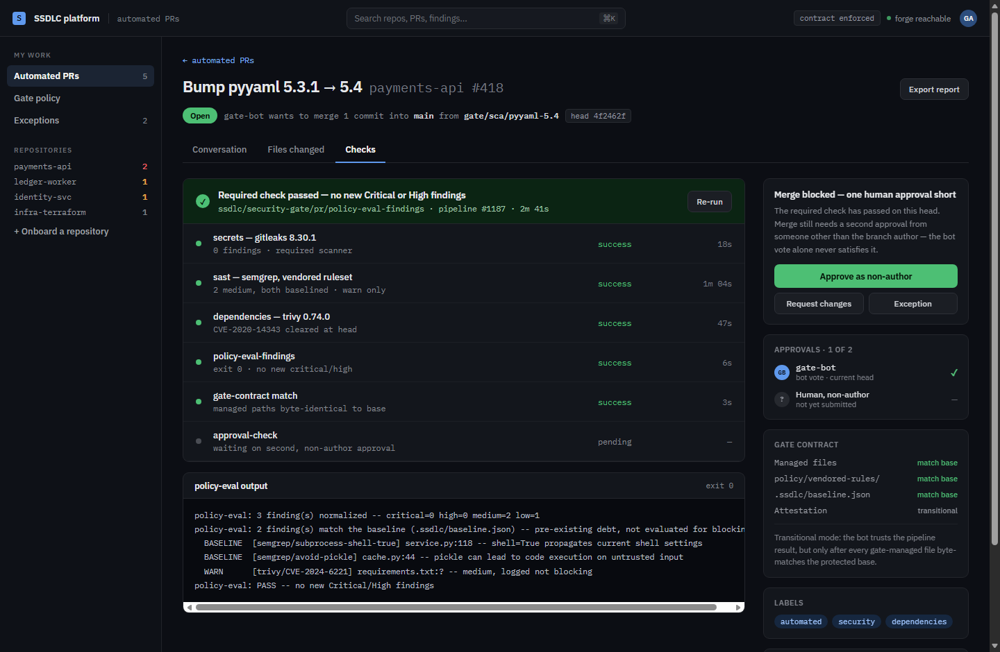
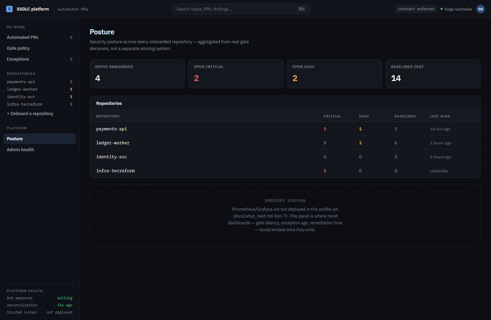
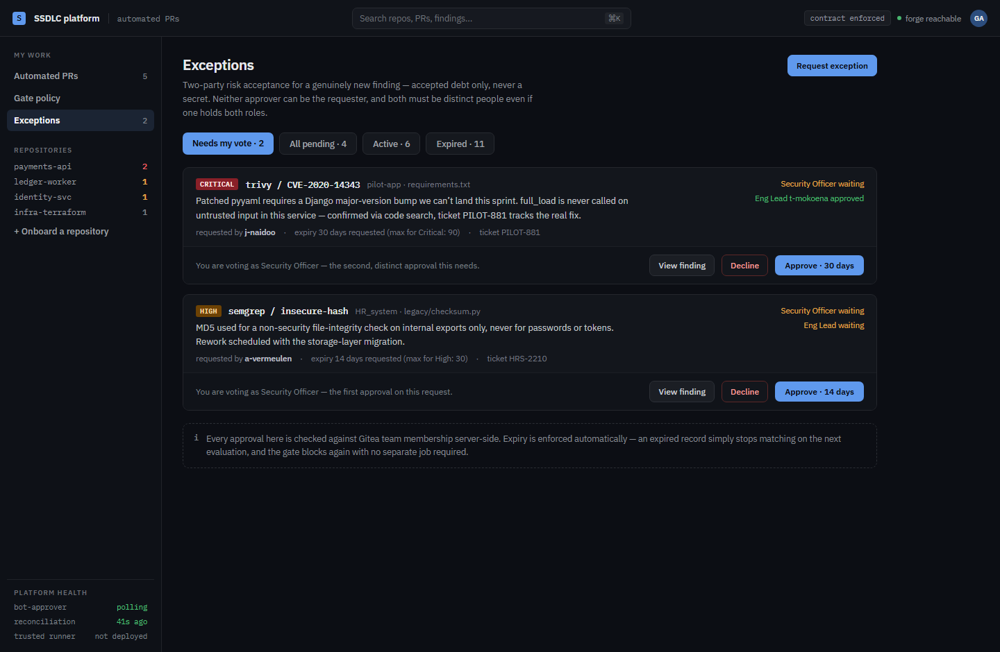
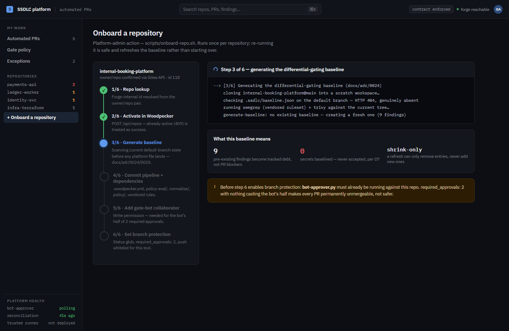

# The SSDLC platform, explained for developers

This is the "I just want to push my code and understand what happens" guide. No prior security
background assumed — every term is explained the first time it appears. If you already know the
platform, [`DEVELOPER_SETUP.md`](DEVELOPER_SETUP.md) and [`SECURITY.md`](../SECURITY.md) are shorter
references; this document is the long-form walkthrough.

**One thing to know before anything else: the screenshots in this guide are a design preview, not
the current product.** The portal shown in sections 4, 6, 8, and 9 — the dark dashboard with a blue
accent — does not exist yet. It is a mockup for a future version of this platform
([`DESIGN.md`](DESIGN.md)'s "D10 Portal", not built). **What you actually see today is plain Gitea and
Woodpecker** — the open-source Git server and CI tool this platform runs on. Every section below says
explicitly which is which, so you are never confused about what's real right now.

(The mockup illustrates its screens with the gate raising its own remediation PRs — a bot opening a
fix for a dependency bump or a leaked secret, shown as "Automated PRs" in its sidebar. Your own PRs,
opened by you pushing code, go through the identical gate and would appear the same way in this
design; the underlying checks, severities, and approval rules described below apply equally to
either.)

---

## 1. What this platform does, in one paragraph

You clone a repository, write code, and push it like normal. Before your change can be merged, an
automatic pipeline scans it for secrets (passwords, API keys), risky code patterns, and vulnerable
dependencies. If it finds something serious, your pull request (PR) is blocked from merging until it's
fixed — automatically, the same way for everyone, with no manual security review needed for the common
case. That's the whole idea: **the platform does not add work for you to do; it removes the need for
someone to manually check for these things every time.**

## 2. What you actually do

If your repository has already been onboarded to this platform (your platform admin does this once,
see [`super_smart_admin.md`](super_smart_admin.md) if you're the admin), your workflow does not change
at all:

1. `git clone` the repository as usual.
2. Write your code, commit it.
3. `git push` — either directly to a branch, or open a pull request.
4. Wait about a minute. Read the result Gitea shows on your commit or PR.

That's it. You never install a scanner, never run a security tool yourself, never configure anything.
The pipeline template, the rules, and the approval requirements were all committed into the repository
during onboarding — before you ever touched it.

### Optional: catch mistakes before you even push

If you want faster feedback than waiting for the server, you can install `pre-commit` locally (see
[`DEVELOPER_SETUP.md`](DEVELOPER_SETUP.md) for the exact version and commands). It runs a quick secret
scan on your machine before a commit completes. **This is a convenience, not a security control** —
`git commit --no-verify` skips it entirely, and it only runs if you installed it. The real gate is the
one described below, and it cannot be skipped.

## 3. What happens the moment you push

Four automatic checks run, in this order, on every push and every pull request:

| Step | Tool | What it looks for |
|---|---|---|
| `secrets` | Gitleaks | Passwords, API keys, tokens accidentally committed into your code |
| `sast` | Semgrep | Risky code patterns (SQL injection, command injection, insecure deserialization, etc.) |
| `dependencies` | Trivy | Known vulnerabilities (CVEs) in your project's third-party packages |
| `policy-eval-findings` | — | Reads the results of the three steps above and makes the actual block/pass decision |

There's a fifth step, `approval-check`, which is about *who* has reviewed your PR, not what the
scanners found — covered in section 7.

**Today**, all of this runs as a Woodpecker pipeline, and you watch it the same way you'd watch any CI
system: a status appears on your commit in Gitea (a colored dot — yellow while running, green if it
passed, red if it failed), and clicking it takes you to the Woodpecker build log with the full output
of each step.

## 4. Reading a result — what a passing/failing check tells you

*Design preview — this is what the planned portal's PR view would show, styled as a Gitea-style PR
page with tabs (Conversation / Files changed / Checks). Today, the equivalent information is in
Gitea's commit-status list plus the Woodpecker build log for each step (see the note under the
screenshot).*

What each part means, reading top to bottom:

- **The tab strip** — Conversation (the PR discussion, including the automated comment explaining
  *why* this PR exists and what it changes), Files changed (a normal diff view), and Checks (shown
  here).
- **The required-check banner** — a one-line summary of whether the gate itself has passed. Here every
  scanner is clean, so the banner is green — but **that alone does not mean the PR can merge**.
- **The checks list** — one row per pipeline step, each with its own pass/fail state and detail line:
  `secrets`, `sast`, `dependencies`, `policy-eval-findings`, `gate-contract match`, and
  `approval-check`. All green here.
- **The explain trace** — the actual decision logic, printed as it ran. This is not simplified or
  summarized — it's the real output of the tool that makes the block/pass call
  (`policy-eval/evaluate-findings.py`), so if you're ever unsure *why* something blocked (or didn't),
  this is the literal answer, not someone's interpretation of it.
- **The sidebar's "Merge blocked" panel** — even with every check green, this example still can't
  merge: only 1 of the 2 required approvals is in (the bot's). See section 7 for why the bot's vote
  alone is never enough. A finding that actually blocks (rather than a missing approval) looks the
  same in shape — the same checks list, just with the failing row in red and the explain trace's `FAIL`
  line naming exactly what needs fixing.

**What this looks like today, for real:** open your PR in Gitea. Below the description, you'll see a
list of status checks (this is Gitea's native feature, not something this platform built). Click
"Details" next to any failing one — that takes you into the Woodpecker build log for that pipeline
step, where you'll find the same scanner output shown in the explain trace above, just as raw console
text rather than a formatted panel.

## 5. Understanding severity — what actually blocks you

Not every finding stops your merge. The platform follows one rule, applied the same way everywhere:

| Severity | What happens | Example |
|---|---|---|
| **Critical** | Blocks the merge immediately | A verified secret, or a dependency CVE with no available fix |
| **High** | Blocks the merge | An exploitable code pattern, a dependency CVE with a fix available |
| **Medium** | Shown as a warning, does **not** block | A pattern that's often but not always a real problem |
| **Low** | Logged only, not shown as a warning | Minor style/hygiene issues |

A **secret** (a real password, key, or token found in your code) is treated as Critical automatically,
every time, with no exceptions — even if the rest of your PR is otherwise clean. If you accidentally
commit a real credential: **do not just remove it in a new commit.** The credential may already exist
in the platform's history. Rotate/revoke it immediately at the source (AWS, the third-party service,
etc.) — removing it from your branch does not undo the exposure. See
[`SECURITY.md`](../SECURITY.md#if-a-gate-fails) for the full guidance.

## 6. "Baselined" vs "new" — why an old repo doesn't block every PR on day one

*Design preview — the dashboard below is the same not-yet-built portal's Posture screen, aggregating
baseline debt across every onboarded repository. Today you'd see this same distinction per-PR, inside
the explain trace from section 4, not as a cross-repo dashboard.*

If your repository already had issues in it *before* it was onboarded to this platform, you are not
suddenly blocked from merging anything until you fix all of them. At onboarding, the platform takes a
snapshot of everything already present — that snapshot is the **baseline**. From then on:

- A finding that **matches the baseline** is pre-existing debt. It's reported so you can see it and
  fix it when you get to it, but it never blocks your PR.
- A finding that's **new** — introduced by your specific change, not in the baseline — blocks exactly
  as described above.

This means: **you are only ever responsible for what you introduce, never for history you didn't
create.** The baseline can only shrink over time (as things get fixed) — it can never silently grow to
quietly accept a new problem.

The one absolute exception: **secrets are never baselined, ever, under any circumstance.** A real
credential blocks your PR the first time it's ever detected, regardless of how old the file is.

## 7. Approvals — the bot and a human, both required

A pull request needs two approvals before it can merge, and they must come from two different people:

1. **The gate bot** votes automatically once all the scanning steps above pass.
2. **A human who did not author the PR** must also approve — normal code review, same as any team
   would do.

Neither one substitutes for the other. Two humans approving does **not** satisfy the bot's half — the
bot's vote specifically confirms the scans passed. And the bot cannot approve on your behalf even if
the scans are clean; a distinct human review is still required.

**If you push a new commit after getting approvals, both are dismissed** and you need fresh ones on
the new commit. This is deliberate — an approval is only meaningful for the exact code it was given
on.

## 8. When you can't just fix it — requesting an exception

*Design preview — this workflow is designed ([`EXCEPTIONS.md`](EXCEPTIONS.md)) but **not built yet**.
Today, there is no "Request exception" button anywhere; the only path past a finding you genuinely
cannot fix right now is a reviewed change to the policy itself, which is a platform-level decision, not
something you do from your PR.*

Once built, this is the intended flow for a real finding you can't fix immediately (a patch that isn't
available yet, a dependency upgrade that needs more testing time): you'd request a time-boxed
exception with a justification, and it would need approval from **two distinct people in named roles**
— a Security Officer and an accountable Engineering Lead — neither of whom can be you, the PR author.
The exception expires automatically; nothing needs a human to remember to re-block it.

**Until this exists**, do not attempt to work around a blocking finding by weakening the pipeline,
editing the policy files, or disabling a check. See
[`SECURITY.md`](../SECURITY.md#if-a-gate-fails) — that's a platform-level decision, made through a
reviewed change, not something to do unilaterally from an application PR.

## 9. Getting your repository onto the platform

*Design preview — this wizard is a mockup. Today, onboarding is a command-line script your platform
admin runs; see the screenshot's caption for what it actually does.*

**This is not something you do yourself.** Onboarding a repository is a one-time, platform-admin
action (`scripts/onboard-repo.sh`) that activates the pipeline, generates the baseline described in
section 6, and sets up branch protection. If your repository isn't onboarded yet, ask your platform
admin — see [`super_smart_admin.md`](super_smart_admin.md) if that's you.

## 10. Common problems and what to do about them

**"My PR is red but I didn't change the file it's complaining about."**
Check whether the finding is in a dependency file (`requirements.txt`, `package.json`, etc.). A
dependency scan re-evaluates against the *current* vulnerability database every time, so a package
that was fine last week can start failing today if a new CVE was published against it — even though
you didn't touch that line.

**"It says I have 2 baselined findings and 1 new one — do I need to fix the baselined ones too?"**
Not to merge this PR. They're pre-existing debt (section 6), visible so you know they exist, but not
blocking. Fix them when convenient, or as separately tracked work.

**"The bot hasn't voted on my PR even though everything is green."**
The bot polls periodically rather than reacting instantly — give it a minute. If it's been much longer,
your platform admin needs to check whether the bot-approver process is actually running (see
[`super_smart_admin.md`](super_smart_admin.md)).

**"I fixed the issue and pushed again, but it's still showing as failing."**
Make sure you're looking at the status for your *latest* commit, not a cached view of an earlier one —
Gitea shows status per-commit, and an old browser tab can be showing a stale one. Refresh the PR page.

**"A dependency has no fix available yet — what do I do?"**
See section 8. Until the exception workflow exists, this needs a conversation with your platform admin
about whether the finding can be safely deferred through a reviewed policy change.

## 11. Where to get real help

- **A gate failure you don't understand:** [`SECURITY.md`](../SECURITY.md)'s "If a gate fails"
  section — the canonical, always-current answer.
- **A suspected real vulnerability in the platform itself, or a real leaked credential:** do **not**
  open a public issue. See [`SECURITY.md`](../SECURITY.md)'s "Reporting a platform weakness" section
  and report it directly and privately.
- **Everything else:** ask your platform admin.
